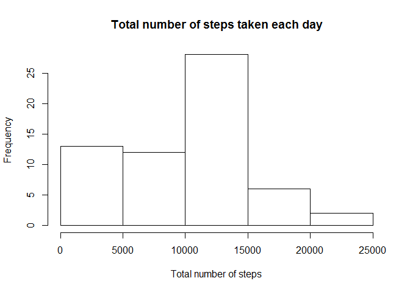
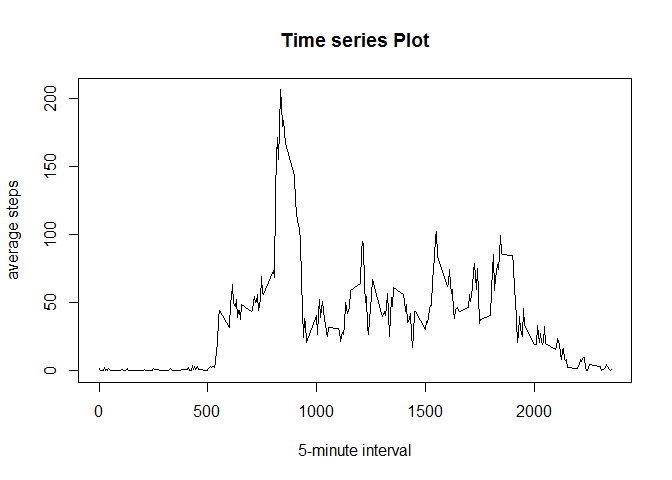
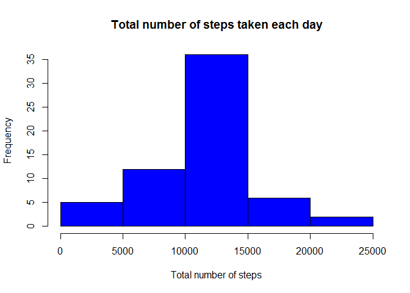
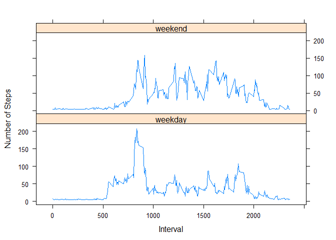

# Reproducible Research: Peer Assessment 1


## Loading and preprocessing the data


```r
unzip("activity.zip")
activity<-read.csv("activity.csv")
```

## What is mean total number of steps taken per day?

* First, the total number of steps taken per day are calculated by the following code ignoring the missing values in the data:


```r
library(dplyr)
```

```
## 
## Attaching package: 'dplyr'
## 
## The following object is masked from 'package:stats':
## 
##     filter
## 
## The following objects are masked from 'package:base':
## 
##     intersect, setdiff, setequal, union
```


```r
by_day<-group_by(activity,date)
totalsteps<-summarize(by_day,totalsteps=sum(steps,na.rm=TRUE))
```

* A histogram of the total number of steps taken each day is then can be made.  


```r
hist(totalsteps$totalsteps,xlab="Total number of steps",
     main="Total number of steps taken each day")
```

 

*  The mean and median of the total number of steps are calculated by the following code


```r
Median<-median(totalsteps$totalsteps)
Mean<-mean(totalsteps$totalsteps)
```
The mean and median of the total number of steps taken each day are 9354.2295082 and 10395 repectively.

## What is the average daily activity pattern?

* The following figure represents a time series plot of the 5-minute interval (X-axis)and the average number of steps taken averaged across all days (Y-axis)  


```r
library(dplyr)
by_interval<-group_by(activity,interval)

averagesteps<-summarize(by_interval,average=mean(steps,na.rm=TRUE))

plot(averagesteps$interval,averagesteps$average,type="l",ylab="average steps",
     xlab="5-minute interval",main="Time series Plot")
```

 

* Which 5-minute interval, on average across all the days in the dataset, contains the maximum number of steps?


```r
max<-averagesteps[which.max(averagesteps$average),]
maxinterval<-max[[1]]
```
The 5-minute interval that contains the maximum number of steps on average is 835


## Imputing missing values

```r
sumna<-sum(is.na(activity))
```
* The total number of missing values in the dataset is 2304

* Strategy for replacing the missing values in the data is by using the average of the steps
*  A new dataset that is equal to the original dataset but with the missing data filled in is created.


```r
nas<-which(is.na(activity$steps))
new<- rep(mean(activity$steps,na.rm=TRUE),times=length(nas))
newactivity<-activity
newactivity[nas,"steps"]<-new

head(newactivity)
```

```
##     steps       date interval
## 1 37.3826 2012-10-01        0
## 2 37.3826 2012-10-01        5
## 3 37.3826 2012-10-01       10
## 4 37.3826 2012-10-01       15
## 5 37.3826 2012-10-01       20
## 6 37.3826 2012-10-01       25
```

*  A histogram of the total number of steps taken each day after replacing the missing value, i.e using the new dataset


```r
library(dplyr)
by_day2<-group_by(newactivity,date)
totalsteps2<-summarize(by_day2,totalsteps=sum(steps))
hist(totalsteps2$totalsteps,col="blue",xlab="Total number of steps",
           main="Total number of steps taken each day")
```

 

*  The mean and median total number of steps taken per day for the new data are then calculated


```r
NewMedian<-median(totalsteps2$totalsteps)
NewMean<-mean(totalsteps2$totalsteps)
```
The mean and median of the total number of steps taken each day in the new dataset are 1.0766189\times 10^{4} and 1.0766189\times 10^{4} respectively.

* The difference between the old and new means is calculated

```r
NewMean-Mean
```

```
## [1] 1411.959
```
The difference between the old and new median is also calculated

```r
NewMedian-Median
```

```
## [1] 371.1887
```
The new mean and median are greater than the old ones. The impact of imputing missing data is getting higher estimates of the total daily number of steps.


## Are there differences in activity patterns between weekdays and weekends?

* A new factor variable in the dataset with two levels - "weekday" and "weekend" indicating whether a given date is a weekday or weekend day is created


```r
newactivity$date<-as.Date(as.character(newactivity$date))
newactivity$weekdays<-weekdays(newactivity$date)
newactivity$weekdays<-factor(newactivity$weekdays)
levels(newactivity$weekdays)<-list(weekday=c("Monday","Tuesday","Wednesday",
                            "Thursday","Friday"),weekend=c("Saturday","Sunday"))
head(newactivity)
```

```
##     steps       date interval weekdays
## 1 37.3826 2012-10-01        0  weekday
## 2 37.3826 2012-10-01        5  weekday
## 3 37.3826 2012-10-01       10  weekday
## 4 37.3826 2012-10-01       15  weekday
## 5 37.3826 2012-10-01       20  weekday
## 6 37.3826 2012-10-01       25  weekday
```

*  The following code and figure represent a panel plot containing a time series plot (i.e. type = "l") of the 5-minute interval (x-axis) and the average number of steps taken, averaged across all weekday days or weekend days (y-axis)


```r
library(dplyr)
library(lattice)

groupedactivity<-group_by(newactivity,interval,weekdays)
groupedavg<-summarize(groupedactivity,meansteps=mean(steps))

xyplot(meansteps~interval|weekdays,data=groupedavg,type="l",layout=c(1,2),xlab="Interval",ylab="Number of Steps")
```

 
